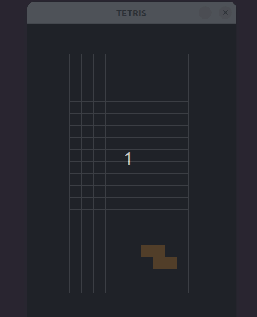

# TETRIS

A TETRIS implementation in Python



# Run

Using the dependencies on your machine (not guarantied to work)

```bash
$ python3 main.py
```

Using a virtual environment:

```bash
$ source env/bin/activate
$ python -m pip install -r requirements.tx
$ python main.py
```
